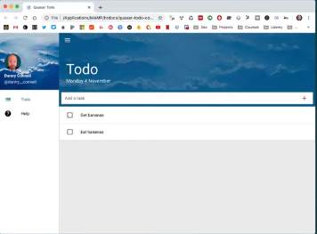
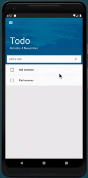
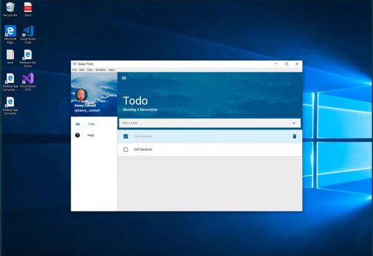
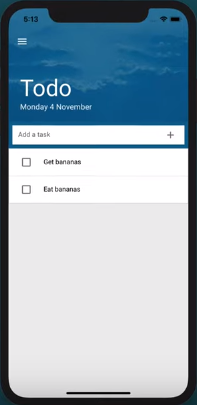

# Quasar Todo (quasar-todo)

A Quasar Framework app

Web version
</img>

Android version
</img>

Electron version
</img>

IOs Version
</img>

## Install the dependencies
```bash
npm install
```

### Start the app in development mode (hot-code reloading, error reporting, etc.) Web
```bash
npx quasar dev
```

### Build electron app:
```bash
quasar dev -m electron
```

### Build IOS app: Needs XCode
```bash
quasar dev -m cordova -T ios
```

### Build Android apk: Needs Android Studio
```bash
quasar dev -m cordova -T android
```

### Build the app for production
```bash
quasar build
```

### Customize the configuration
See [Configuring quasar.conf.js](https://quasar.dev/quasar-cli/quasar-conf-js).
